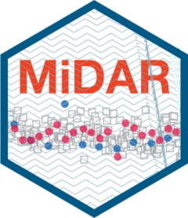

# MiDAR 

<!-- badges: start -->

[](https://lifecycle.r-lib.org/articles/stages.html#experimental) [](https://app.codecov.io/gh/SLINGhub/midar?branch=master)

<!-- badges: end -->

MiDAR is an R package designed for reproducible post-processing, assessment, quality control, and reporting of small-molecule mass spectrometry (MS) datasets, including those from lipidomics and metabolomics. It offers a complete workflow, allowing users to import data, apply normalization and quantification methods, perform isotope correction, and address drift and batch effects. Additionally, MiDAR supports feature filtering, sharing curated datasets in various formats, and generating quality control plots and metrics to evaluate analytical data quality and the effects of post-processing steps.

MiDAR is intended for both analytical and bioinformatics scientists. ItIts core tools are accessible to users with a basic understanding of R or coding, while also allowing for more advanced customizations and access to all data. With this approach, the package supports analysts in annotating, inspecting, and processing their data independently, and facilitates the sharing of detailed annotated datasets and processing information for collaboration with colleagues, including bioinformaticians, for further analyses.

MiDAR emphasizes fully documented, reproducible data processing workflows and serves as a tool for creating automated data processing pipelines.

## Installation

In the console run:

``` r
if (!require("pak")) install.packages("pak")
pak::pkg_install("SLINGhub/midar")
```

## Example workflow

``` r
library(midar)

# Create a MidarExperiment object
myexp <- MidarExperiment()

# Load data and available metadata
myexp <- data_import_mrmkit(myexp, path = "data.tsv")
myexp <- metadata_import_midarxlm(myexp, path = "metadata.csv")


# Normalize and quantitate each feature by internal standards
myexp <- calc_normalize_by_istd(myexp)
myexp <- calc_quantify_by_istd(myexp)

# Filter features according to QC criteria
mexp <- qc_apply_feature_filter(
  data = mexp, 
  max.cv.conc.bqc = 30,
  min.min.min.min.signalblank.median.spl.pblk = 3,
)

# Export concentration data
myexp <- report_write_csv(
  myexp, 
  path = "mydata.csv", 
  variable = "norm_intensity", 
  filter_data = FALSE)
```
