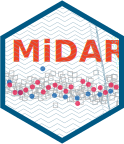

# MiDAR <a href="https://slinghub.github.io/midar/"></a>

<!-- badges: start -->

[](https://lifecycle.r-lib.org/articles/stages.html)
[](https://github.com/SLINGhub/midar/actions/workflows/R-CMD-check.yaml)
[](https://app.codecov.io/gh/slinghub/midar?branch=main)

<!-- badges: end -->


`MiDAR` is an R package designed for the reproducible post-processing,
quality control, and reporting of quantitative small-molecule mass
spectrometry (MS) data. Its modular functionalities and defined data
structure, support diverse analytical designs, data formats, and
processing tasks, including metabolomics and lipidomics. `MiDAR` is
intended for both analytical and bioinformatics scientists and to
facilitate collaboration between them. It enables the creation of
customizable, supervisable, and documented data processing workflows
through intuitive high-level R functions and data objects.

`MiDAR`'s core tools, accessible also to those with limited R
experience, allow analysts to annotate, inspect, and process data. This
includes importing data and metadata from various file formats, managing
and organizing data with integrity checks, performing processing tasks
such as quantification, drift/batch correction, and applying QC-based
feature filtering. Users can assess data quality using QC metrics and
diagnostic plots, and share both raw and processed data along with the
entire processing workflow for further analyses and documentation.

`MiDAR` also serves as a validated software framework for building robust and 
scalable data processing pipelines.

# Getting Started
Please visit the [Getting Started](https://slinghub.github.io/midar/articles/00_get_started.html) page for tutorials and documentation on `MiDAR`.

#  Installation
To install, or to update, MiDAR, run the following code in the R console:
``` r
if (!require("pak")) install.packages("pak")
pak::pkg_install("SLINGhub/midar")
```

#  Example Workflow

``` r
# Path of example files included with this package
dir_path <- system.file("extdata",  package = "midar")

# Create a MidarExperiment object
mexp <- MidarExperiment()

# Load data and metadata
mexp <- import_data_mrmkit(mexp,
                           path = file.path(dir_path, "MRMkit_demo.tsv"),
                           import_metadata = TRUE)

mexp <- import_metadata_analyses(mexp, 
                                 path = file.path(dir_path, "MRMkit_AnalysesAnnot.csv"), 
                                 ignore_warnings = T)
mexp <- import_metadata_istds(mexp, 
                              path = file.path(dir_path, "MRMkit_ISTDconc.csv"))

# Normalize and quantitate features by internal standards
mexp <- normalize_by_istd(mexp)
mexp <- quantify_by_istd(mexp)

# Drift and batch-effect correction
mexp <- correct_drift_cubicspline(mexp, variable = "conc", ref_qc_types = "BQC")
mexp <- correct_batch_centering(mexp, variable = "conc", ref_qc_types = "BQC")

# Plot analysis time-trends of final concentrations of each feature 
plot_runscatter(mexp,
                variable = "conc",
                qc_types = c("BQC", "TQC", "SPL", "PBLK", "SBLK"),
                cap_outliers = TRUE,
                output_pdf = FALSE,
                path = "./output/runscatter_istd.pdf")

# Set features QC-filter criteria   
 mexp <- filter_features_qc(mexp,
                            max.cv.conc.bqc = 25,
                            min.signalblank.median.spl.pblk = 3,
                            include_qualifier = FALSE,
                            include_istd = FALSE)
 
# Save concentration data
 save_dataset_csv( mexp, 
                   path = "mydata.csv", 
                   variable = "conc", 
                   filter_data = TRUE)
```

# Contributor Code of Conduct

Please note that the midar project is released with a [Contributor Code
of
Conduct](https://contributor-covenant.org/version/2/0/CODE_OF_CONDUCT.html).
By contributing to this project, you agree to abide by its terms.
