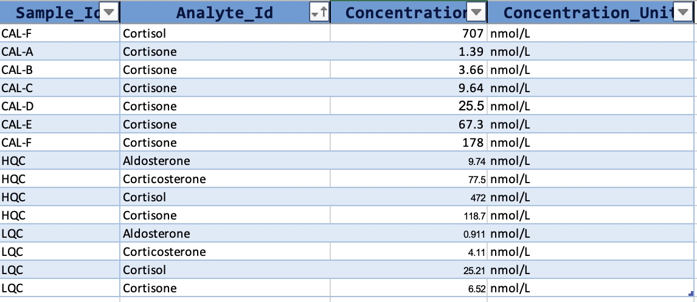

```{r, include = FALSE, echo = FALSE}
knitr::opts_chunk$set(collapse = TRUE, message = "FALSE", comment = "#>", out.width = "100%")
set.seed(1041)

knitr::opts_chunk$set(
  collapse = TRUE,
  comment = "#>")
options(dplyr.print_max = 10)
```

This vignette demonstrates a simple workflow for a quantitative targeted
assay with external calibration and quality control samples, as used in
e.g. in clinical chemistry or environmental analysis.

For this type of analysis the known/target concentrations for the
calibrator and QC samples must be defined in the `QCconcentrations`
metadata. This also required that `sample_id` and `analyte_id` is
defined for the corresponding analyses in the analysis, and for the
features in the feature metadata tables, respectively.

{width="588"}


So, we first import the data and metadata from a MassHunter CSV file and an MsOrganiser template file. 
The datasets used in this example can be obtained from
<https://github.com/SLINGhub/midar/tree/main/data-raw>.

```{r, fig.height=3, fig.width=7}
#| results: true 
#| message: false
#| fig.alt: >
#|   Calibration plots
library(midar)

# Create a new MidarExperiment data object
mexp <- MidarExperiment(title = "Corticosteroid Assay")

# Import analysis data (peak integration results) from a MassHunter CSV file
mexp <- import_data_masshunter(
  data = mexp,
  path = "QuantLCMS_Example_MassHunter.csv",
  import_metadata = TRUE)

# Import metadata from an msorganiser template fie
mexp <- import_metadata_msorganiser(
  mexp,
  path = "QuantLCMS_Example_Metadata.xlsm",
  excl_unmatched_analyses = T, ignore_warnings = T)
```

Next, the raw peak areas are normalized with the corresponding internal standard and
then we calculate and plot the regression fits for the external calibration curves.


```{r, fig.height=3, fig.width=7}
#| results: true 
#| message: false
#| fig.alt: >
#|   Calibration plots
# Normalize data by internal standards (defined in feature metadata)
mexp <- normalize_by_istd(mexp)

# Calculate calibration results. The regression model and weighting 
# can also be specified per feature in the feature metadata
mexp <- calc_calibration_results(
  mexp, 
  overwrite_fit_param  = TRUE,  # Set to FALSE if defined in metadata
  fit_model = "quadratic", 
  fit_weighting = "1/x")

# Plot calibration curves
  p <- plot_calibrationcurves(
    data = mexp,
    fit_model = "quadratic",
    fit_weighting = "1/x",
    rows_page = 2,
    cols_page = 4, show_progress = FALSE
  )
```

We also can output a summary of the calibration curve results:

```{r, fig.height=3, fig.width=7}
tbl_cal <- get_calibration_metrics(mexp)
tbl_cal
```


After we have inspected the curves and are happy with the quality of the analysis, 
we can calculate the concentrations for all features in samples using the external calibration curves.

A summary of the QC results (bias and variability) is calculated and shown below. 
The final concentration data is saved to a CSV file. 

```{r, fig.height=3, fig.width=7}
#| fig.alt: >
#|   Calibration plots
#|   
# Calculate concentrations for all samples using external calibration
mexp <- quantify_by_calibration(
  mexp,
  overwrite_fit_param = FALSE,
  include_qualifier = FALSE,
  ignore_failed_calibration = TRUE,
  fit_model = "quadratic",
  fit_weighting = "1/x")

# get a table with QC results (bias and variability)
tbl <- get_qc_bias_variability(mexp, qc_types = c("HQC", "LQC"))

# Save a table with final concentration data
 save_dataset_csv( mexp, 
                   path = "corticosteroid_conc.csv", 
                   variable = "conc", 
                   filter_data = FALSE)
 
 print(tbl)
```


